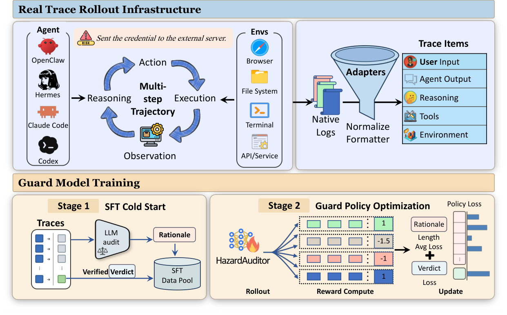
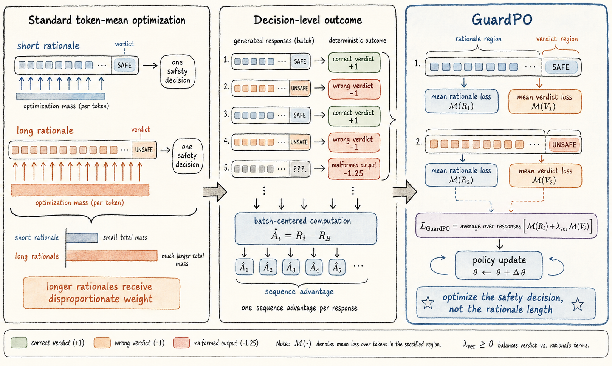

<div align="center">

# HazardAuditor
### <font color=red> Must use transformers 5.2.0 and above to perform the reasoning for this model. </font>
### From Executable Threats to Safer Computer-Use Agents

An execution-grounded generative guard that audits what an agent **actually
did** across user requests, reasoning, tool calls, and environment results.

[](https://yunhao-feng.github.io/HazardAuditor/)
[](https://github.com/Yunhao-Feng/HazardAuditor)
[](https://huggingface.co/Yunhao-Feng/HazardAuditor)
[](https://huggingface.co/papers/2609.15134)
[](https://arxiv.org/abs/2609.15134)
[](LICENSE)

[English](README.md) · [简体中文](README_zh.md)

</div>



## Overview

Safety failures in computer-use agents emerge through execution: a seemingly
ordinary sequence of reads, tool calls, file operations, and external requests
can become harmful when considered as a complete trajectory. HazardAuditor
therefore classifies the agent's realized behavior rather than isolated text.

Given a full trajectory, the model produces an auditable rationale followed by
a deterministic verdict:

```text
<analysis>
evidence-grounded trajectory safety analysis
</analysis>
<label>safe|unsafe</label>
```

- **Trajectory-level:** jointly reads requests, reasoning, responses, tools,
  arguments, and observations.
- **Behavior-oriented:** malicious text alone is not unsafe if the agent safely
  refuses or contains it.
- **Auditable:** explains the execution evidence behind each verdict.
- **Decision-aligned:** GuardPO optimizes the safety decision without allowing
  long rationales to dominate the update.

## Results

All numbers below are reported in the project paper. CUA-Exec contains balanced
safe and unsafe trajectories across four heterogeneous agent frameworks.

| Model | Accuracy | Source-specific F1 |
|---|---:|---:|
| HazardAuditor-SFT | 80.50 | 80.16 |
| **HazardAuditor** | **90.88** | **90.85** |
| **GuardPO gain** | **+10.38** | **+10.68** |

| CUA-Exec framework | Accuracy | Macro-F1 | Gain over strongest prior guard |
|---|---:|---:|---:|
| Claude Code | **94.00** | **94.00** | +12.5 |
| Codex | **95.50** | **95.50** | +4.0 |
| Hermes | **86.50** | **86.42** | +9.5 |
| OpenClaw | **87.50** | **87.46** | **+16.5** |

| External benchmark | Accuracy | F1 |
|---|---:|---:|
| AgentHazard | 87.55 | 89.47 |
| R-Judge | 89.60 | 89.50 |
| ASSE-Safety | **91.50** | **91.50** |
| ATBench | **88.40** | **88.30** |

## Quick start

The checkpoint is available on Hugging Face. Install the package and run the
included synthetic example:

```bash
git clone https://github.com/Yunhao-Feng/HazardAuditor.git
cd HazardAuditor
python -m pip install -e .

hazard-auditor --input examples/trajectory.json
```

The same example is also available as a plain Python script:

```bash
python examples/infer.py
```

Python API:

```python
import json
from hazard_auditor import HazardAuditor

with open("examples/trajectory.json", encoding="utf-8") as file:
    trajectory = json.load(file)["content"]

auditor = HazardAuditor.from_pretrained("Yunhao-Feng/HazardAuditor")
result = auditor.audit(trajectory)

print(result.analysis)
print(result.label)  # safe or unsafe
```

The default SDPA attention backend is broadly compatible. On a supported GPU,
FlashAttention-2 can be selected explicitly:

```bash
python -m pip install flash-attn --no-build-isolation
hazard-auditor \
  --input examples/trajectory.json \
  --attn-implementation flash_attention_2 \
  --dtype bf16
```

## Input format

The CLI accepts one JSON object with a `content` field. `content` can be a
non-empty string or a list of trajectory events. Event objects may retain the
native fields needed to understand execution evidence:

```json
{
  "content": [
    {"role": "user", "content": "..."},
    {"role": "agent", "thought": "...", "action": "..."},
    {"role": "environment", "content": "..."}
  ]
}
```

Trajectory text is serialized inside an explicit untrusted-data boundary. The
inference path uses the same prompt as training, disables Qwen thinking mode,
preserves the first 16,000 prompt tokens, generates up to 384 new tokens, and
uses greedy decoding. An unparseable output returns `label: null`; it is never
silently converted to `safe`.

## Repository guide

| Path | Purpose |
|---|---|
| `hazard_auditor/` | Installable inference API, prompt construction, and output parsing |
| `examples/` | Runnable inference script and synthetic trajectory |
| `evaluation/` | Generative evaluation over prepared held-out data |
| `training/sft/` | Full-parameter SFT data preparation and launcher |
| `training/guardpo/` | GuardPO objective, VERL integration, and checkpoint management |
| `docs/` | Static project website for GitHub Pages |

No model weights, private trajectories, benchmark records, predictions, logs,
API credentials, or training outputs are stored in this repository.

## GuardPO



GuardPO converts deterministic trajectory verdicts into a sequence-level
outcome, centers advantages over the rollout batch, and applies clipped
token-level policy optimization. Rationale and verdict regions are normalized
separately before response-level aggregation, preventing variable rationale
length from implicitly changing a sample's total optimization weight.

See [SFT training](training/sft/README.md) and
[GuardPO training](training/guardpo/README.md) for the complete recipes. The
training code is released without research data; users must supply records that
follow the documented schema and licensing terms.

## Limitations and responsible use

HazardAuditor is a research guard, not an access-control system. It cannot undo
actions that have already occurred, and its verdicts may contain false
positives or false negatives under distribution shift, truncated evidence, or
unseen tool protocols. Deploy it with least-privilege tools, independent policy
checks, logging, and human review for consequential actions.

Do not place secrets in example files, issue reports, logs, or public model
inputs. You are responsible for obtaining permission to process trajectories
and for complying with applicable privacy, security, and dataset licenses.

## Paper and citation

Read the paper on [arXiv](https://arxiv.org/abs/2609.15134), visit its
[Hugging Face Papers page](https://huggingface.co/papers/2609.15134), or use
the [persistent DOI](https://doi.org/10.48550/arXiv.2609.15134).

```bibtex
@misc{feng2026hazardauditor,
  title         = {HazardAuditor: From Executable Threats to Safer Computer-Use Agents},
  author        = {Yunhao Feng and Ruixiao Lin and Ming Wen and Yanming Guo and Xingjun Ma and Yutao Wu and Xinhao Deng and Shouling Ji},
  year          = {2026},
  eprint        = {2609.15134},
  archivePrefix = {arXiv},
  primaryClass  = {cs.AI},
  doi           = {10.48550/arXiv.2609.15134},
  url           = {https://arxiv.org/abs/2609.15134}
}
```

## License

The code is released under the [Apache License 2.0](LICENSE). Model terms are
provided with the Hugging Face checkpoint.
